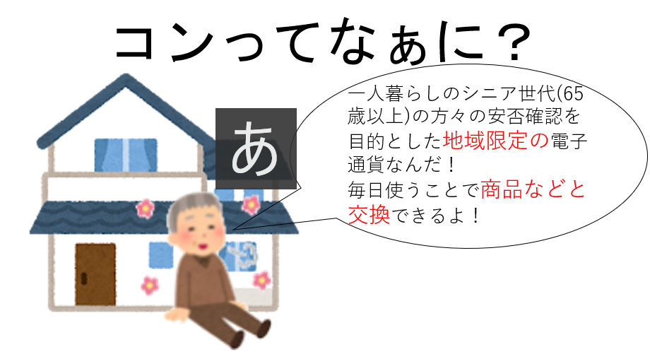
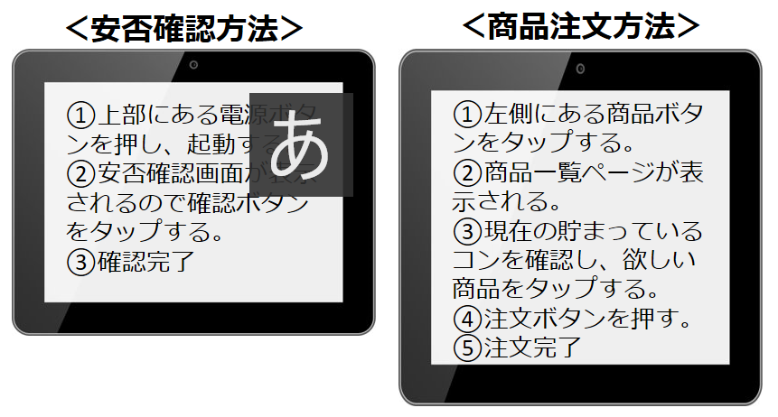
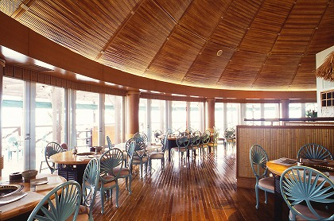
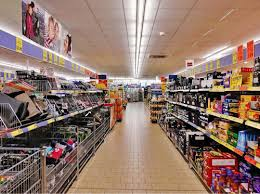
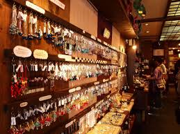
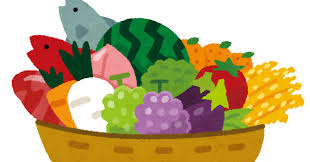
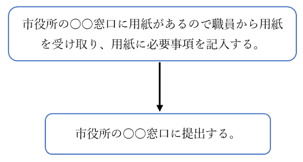
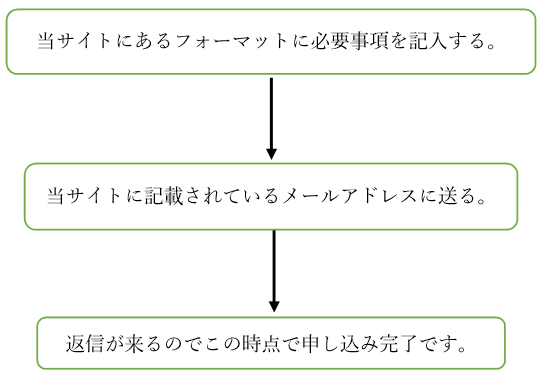

   

# タブレット使用方法  
   
# 導入事例  
* 2019/09/14 ○○市での導入  
コンが使えるお店は約200店舗   
使えるお店は中小から大型店舗まで。  
カテゴリーも「グルメ」「レストラン飲食」「雑貨・日用品」「サービス」など8種類  
* 2019/10/28 △△町での導入  
プレミアム商品券事業としてスタート  
2019年5月11日発売開始、同年9月30日まで利用可能。  
総発行コンは1千万円相当（プレミアム率10%）  
# * ポイント利用例  
## コンを還元  
プレミアム商品券  
## コンを利用  
* # レストラン  
* # スーパー  
* # 雑貨量販店  
* # 特産品  
# 申し込み方法

 方法① 

 方法② 

